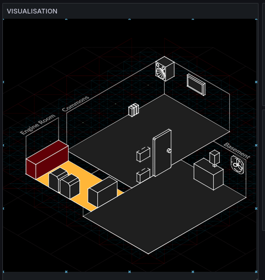

# Space State Visualiser

A system to visualise open/closed state, and the on/off state of various sensors/objects/sockets in Sheffield Hackspace.



## Visuals

The visuals are generated by [nnenov](https://www.nnenov.eu/)

## Visualisation

The visualisation is in Grafana.

## Setup

Set up a canvas in a Grafana Dashboard, and name it `VISUALISATION`. Optionally, add a few SVG elements.

Also, add a service account and put the API key into `.env`. (`cp .env.example .env`)

### View Dashboard JSON

```bash
$ ./get_dashboard.sh 25t62w56-25ttg-252d-24gf-28thjf8wsgfws \
    tee dashboard.json
{
  "annotations": {
    "list": [
      {
        "builtIn": 1,
        "datasource": {
          "type": "grafana",
          "uid": "-- Grafana --"
        },
        "enable": true,
        "hide": true,
        "iconColor": "rgba(0, 211, 255, 1)",
        "name": "Annotations & Alerts",
        "type": "dashboard"
      }
    ]
  },
  "editable": true,
  "fiscalYearStartMonth": 0,
  "graphTooltip": 0,
  "links": [],
  "panels": [
    {
  …
  …
}
```

### View elements

This visualisation relies on SVG logos on a Grafana Canvas. If you've saved the Grafana dashboard as `dashboard.json`, see the elements like:

```bash
# see all
cat dashboard.json | jq -c '.panels[] | select(.title == "VISUALISATION") | .options.root.elements'
# see first (example)
cat dashboard.json | jq '.panels[] | select(.title == "VISUALISATION") | .options.root.elements[0]'
```

example of an element (static). When it is a dynamic element, then `.config.path.mode` should be switched to `field` (not `fixed`) — it's easy to do this via the GUI.

```json
{
  "background": {
    "color": {
      "fixed": "transparent"
    }
  },
  "border": {
    "color": {
      "fixed": "transparent"
    }
  },
  "config": {
    "fill": {
      "fixed": "transparent"
    },
    "path": {
      "field": "eng_bench",
      "fixed": "https://server.alifeee.net/static/shhm/state/objects.engineRoom_bench.NA.svg",
      "mode": "fixed"
    }
  },
  "constraint": {
    "horizontal": "left",
    "vertical": "top"
  },
  "links": [],
  "name": "eng_bench",
  "placement": {
    "height": 540,
    "left": 0,
    "rotation": 0,
    "top": 0,
    "width": 540
  },
  "type": "icon"
}
```

### View overrides

In order to be dynamic, this visualisation uses overrides to change the value of an logo's SVG URL based on the content of a field, via overrides.

```bash
# see all
cat dashboard.json | jq -c '.panels[] | select(.title == "VISUALISATION") | .fieldConfig.overrides'
# see single override
cat dashboard.json | jq '.panels[] | select(.title == "VISUALISATION") | .fieldConfig.overrides[0]'
```

An example of an override. This override changes the icons of anything which is linked to the field `eng_bench`. It uses a value match so is set to on if the value is `ON`, and a regex to match anything else.

```json
{
  "matcher": {
    "id": "byName",
    "options": "eng_bench"
  },
  "properties": [
    {
      "id": "mappings",
      "value": [
        {
          "options": {
            "ON": {
              "icon": "https://server.alifeee.net/static/images/shhm/state/objects.engineRoom_bench.on.svg",
              "index": 0
            }
          },
          "type": "value"
        },
        {
          "options": {
            "pattern": ".*",
            "result": {
              "icon": "https://server.alifeee.net/static/images/shhm/state/objects.engineRoom_bench.off.svg",
              "index": 1
            }
          },
          "type": "regex"
        }
      ]
    }
  ]
}
```

### Create new element

```bash
function make_element_json() {
  URL_BASE="${1}"
  id="${2}"
  name="${3}"

  config_element='.
    | .background.color.fixed = "transparent"
    | .border.color.fixed = "transparent"
    | .config.fill.fixed = "transparent"
    | .config.path.fixed = $img_url + ".NA.svg"
    | .config.path.field = $name
    | .config.path.mode = "fixed"
    | .constraint.horizontal = "left"
    | .constraint.vertical = "top"
    | .links = []
    | .name = $name
    | .placement.height = 540
    | .placement.width = 540
    | .placement.left = 0
    | .placement.rotation = 0
    | .placement.top = 0
    | .type = "icon"
    '
  jq -n \
    --arg name "${name}" \
    --arg img_url "${URL_BASE}${id}" \
    "${config_element}"
}

el_json=$(
  make_element_json "https://server.alifeee.net/static/shhm/state/objects." "Commons_TVDisplay" "com_tv"
)
echo "${el_json}" | jq

```

### Create new override

```bash
function make_override_json() {
  URL_BASE="${1}"
  id="${2}"
  name="${3}"
  on_state="${4}"

  config_override='.
    | .matcher.id = "byName"
    | .matcher.options = $name
    | .properties.id = "mappings"
    | .properties.value[0].type = "value"
    | .properties.value[0].options |= (.[$on_state].index = 0)
    | .properties.value[0].options |= (.[$on_state].icon = $img_url + ".on.svg")
    | .properties.value[1].type = "regex"
    | .properties.value[1].options.pattern = ".*"
    | .properties.value[1].options.result.index = 1
    | .properties.value[1].options.result.icon = $img_url + ".off.svg"
    '

  jq -n \
    --arg name "${name}" \
    --arg img_url "${URL_BASE}${id}" \
    --arg on_state "${on_state}" \
    "${config_override}"
}

ovrd_json=$(
  make_override_json "https://server.alifeee.net/static/shhm/state/objects." "engineRoom_bench" "eng_bench" "ON"
)
echo "${ovrd_json}" | jq
```

### Put items into dashboard JSON

The above just generate elements/overrides, but to put them into the JSON, use something like:

```bash
dashboard_id="25t62w56-25ttg-252d-24gf-28thjf8wsgfws"
./get_dashboard.sh "${dashboard_id}" > dashboard.json
panel_title="VISUALISATION"
cat dashboard.json \
  | jq \
    --arg paneltitle "${panel_title}" \
    --argjson newelement "${el_json}" \
    '.panels |= map(
      if .title == $paneltitle then
        (.options.root.elements += [$newelement])
      else
        .
      end
    )' \
  | sponge dashboard.json
./set_dashboard.sh "${dashboard_id}" dashboard.json
./get_dashboard.sh "${dashboard_id}" > dashboard.json
```

### Add all elements

create list of commands to generate elements (you have to manually set the names)

```bash
ls | grep objects | sed -E s'/objects\.//; /\.(off|on)/d; s/\.NA\.png//; s+^+el_json=$(make_element_json https://server.alifeee.net/static/shhm/state/objects. +; s/$/ NAME)/'
```
